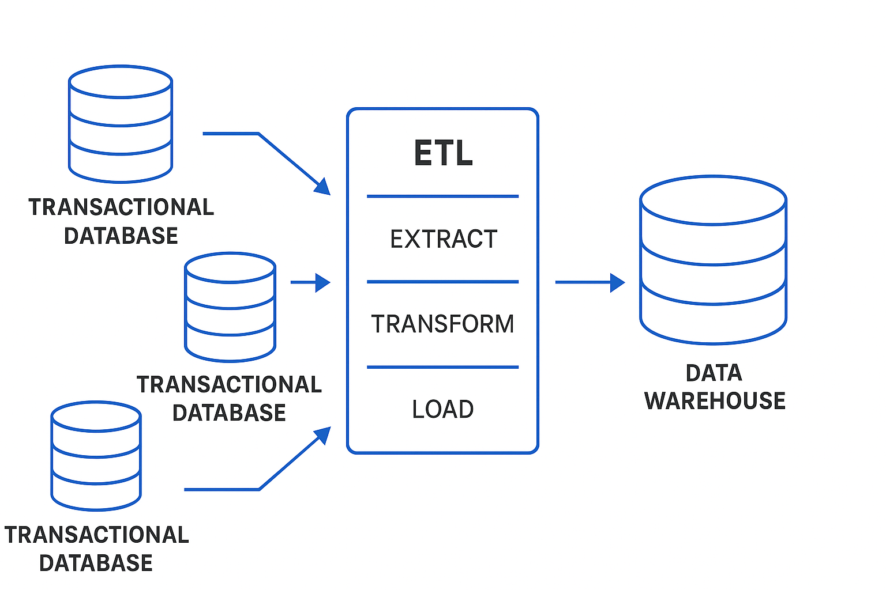
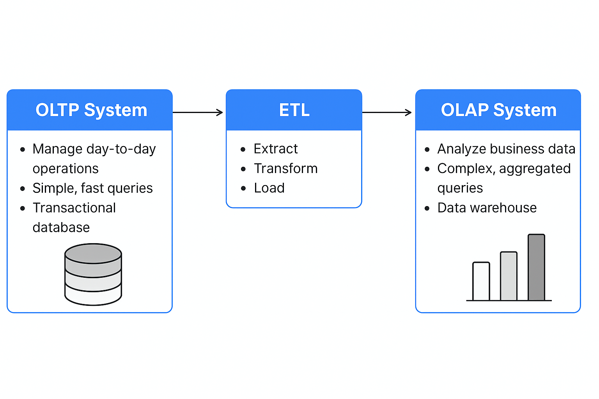

A Data Warehouse is a system that combine data from multiple sources, organizes it under a single architecture, and helps organizations make better decisions. It simplifies data handling, storage, and reporting, making analysis more efficient. Data Warehouse Architecture uses a structured framework to manage and store data effectively.

EXAMPLE: 
A retail company collects data from:
    Online sales system
    In-store POS systems
    Customer feedback tools
All this data is extracted, transformed, and loaded (ETL) into a data warehouse like Amazon Redshift, Google BigQuery, or Snowflake, where analysts can generate sales reports, trend analyses, or customer insights.

In other words: Data warehousing is the process of collecting, storing, and managing large volumes of data from multiple sources in a centralized repository, called a data warehouse, for the purpose of reporting, analysis, and decision-making.



ETL (Extract, Transform, Load):
    Extract: Data is gathered from various source systems (e.g., transactional databases, flat files).
    Transform: Data is cleaned, formatted, and transformed to fit the data warehouse schema.
    Load: The transformed data is loaded into the data warehouse for storage and analysis.


### **Data Warehouse Architecture**

The architecture of a **Data Warehouse (DW)** is designed to handle large volumes of data, making it suitable for efficient querying, reporting, and analysis. Data warehouse architecture typically involves **multiple layers** that work together to gather, store, and present data for business intelligence (BI) applications.

Here’s an overview of the **key components** in data warehouse architecture:

---

### **1. Data Source Layer (Data Sources)**

This layer represents the various **source systems** that feed data into the data warehouse. The sources can be internal systems, external data feeds, or any other systems where data is created. Common sources include:

* **Operational Databases**: Systems such as transaction databases, CRM, ERP, etc.
* **Flat Files**: CSV, Excel files, etc.
* **Web Data**: Logs, sensor data, external APIs.
* **Other Data Warehouses or Data Marts**: Data can be pulled from other DWs or marts for consolidation.

**Key Tasks:**

* Extract data from various formats and systems.
* Data is collected from operational databases, transactional systems, and external data sources.

---

### **2. ETL Layer (Extract, Transform, Load)**

The **ETL** process is a key part of the data warehouse architecture. It is responsible for **extracting** data from the source systems, **transforming** it to fit the data warehouse schema, and then **loading** the data into the data warehouse.

#### **Extract:**

* Data is gathered from the various source systems.
* Data extraction can be **full extraction** (extract all data) or **incremental extraction** (extract only new or changed data).

#### **Transform:**

* **Data Cleansing**: Remove duplicates, correct errors, and ensure data integrity.
* **Data Formatting**: Standardize data (e.g., date format, currency conversion).
* **Aggregation**: Summarize or aggregate data for analytical purposes (e.g., monthly sales totals).
* **Data Mapping**: Ensure that data aligns with the target warehouse schema.

#### **Load:**

* Data is loaded into the data warehouse in an optimized format.
* Depending on the architecture, loading can happen in **batch** (e.g., daily) or **real-time** (streaming) fashion.

**ETL Tools**: Tools like **Apache NiFi**, **Informatica**, **Talend**, and **Microsoft SSIS** are commonly used to handle ETL processes.

---

### **3. Data Warehouse Layer (Storage Layer)**

This is the **core layer** of the data warehouse, where data is **stored** in an optimized, structured format for querying and analysis.

#### **Data Models**:

* Data in the warehouse is organized using data models, such as:

  * **Star Schema**: A central fact table surrounded by dimension tables.
  * **Snowflake Schema**: A more normalized version of the star schema where dimension tables are broken into more detailed sub-dimensions.
  * **Galaxy Schema**: Similar to a star schema, but it contains multiple fact tables related to different subject areas.

#### **Storage Formats**:

* Data can be stored in relational databases (e.g., **SQL Server**, **Oracle**) or in more modern columnar storage systems (e.g., **Google BigQuery**, **Amazon Redshift**).
* **OLAP Cubes**: A specialized format for multi-dimensional data analysis, optimized for fast querying.

---

### **4. Data Mart Layer (Optional)**

A **Data Mart** is a smaller, subject-specific subset of the data warehouse. Data marts are designed to serve specific departments or business units (e.g., sales, finance). This layer is not always present in every architecture but is useful in larger organizations.

#### **Types of Data Marts**:

* **Dependent Data Mart**: Sourced directly from the data warehouse.
* **Independent Data Mart**: Sourced directly from operational systems or external sources.

---

### **5. Presentation Layer (Access Layer)**

The **presentation layer** is where the data is made available for analysis, reporting, and business intelligence. This layer allows business analysts, managers, and decision-makers to query the data warehouse and extract valuable insights.

#### **Tools in the Presentation Layer**:

* **BI Tools**: Tools like **Power BI**, **Tableau**, **QlikView**, or **Looker** allow users to visualize and report on the data stored in the warehouse.
* **OLAP Tools**: These allow users to conduct multidimensional analysis (e.g., cube analysis) and drill-downs to explore data.
* **Reporting Tools**: Tools for generating predefined reports and dashboards.

**Key Tasks**:

* Visualize data (charts, graphs, and reports).
* Perform **ad-hoc querying** to extract insights.
* Perform **data mining** or advanced analytics.

---

### **6. Metadata Layer**

The **metadata layer** contains information about the structure, relationships, and definitions of the data within the data warehouse. Metadata is essentially **data about the data**.

#### **Types of Metadata**:

* **Business Metadata**: Describes the data in business terms (e.g., "Revenue" is the total sales amount).
* **Technical Metadata**: Describes the technical structure of the data (e.g., data types, column names, table structures).
* **Operational Metadata**: Describes the ETL processes, such as load times, data quality, and transformations.

**Metadata Management** tools help in managing the metadata and ensuring that users understand the data they are working with.

---

### **7. Data Governance & Security Layer**

This layer is concerned with ensuring the data is used properly and securely. It involves enforcing policies for data quality, security, and access control.

#### **Key Components**:

* **Data Quality**: Ensuring the data is accurate, complete, and reliable.
* **Security**: Managing who can access the data (user roles, permissions).
* **Compliance**: Ensuring the data meets regulatory requirements (e.g., GDPR, HIPAA).
* **Data Lineage**: Tracking the flow of data from source to warehouse and ensuring transparency.

---

### **Diagram of Data Warehouse Architecture**

Here's a simplified **Data Warehouse Architecture** diagram:

```
            +------------------+
            |   Data Sources   |   <--- (Operational Systems, External Sources, etc.)
            +------------------+
                     |
                     V
            +------------------+
            |     ETL Layer    |  <--- (Extract, Transform, Load)
            +------------------+
                     |
                     V
            +------------------+
            |  Data Warehouse  |  <--- (Centralized storage, Fact Tables, Dimension Tables)
            +------------------+
                     |
                     V
            +------------------+  
            |  Data Mart Layer |  <--- (Subject-specific data marts)
            +------------------+
                     |
                     V
            +------------------+
            | Presentation Layer|  <--- (BI Tools, Reports, Dashboards)
            +------------------+
                     |
                     V
            +------------------+
            |  Metadata Layer  |  <--- (Data Definitions, Data Lineage)
            +------------------+
                     |
                     V
            +------------------+
            |  Security Layer  |  <--- (Data Security, Compliance, Access Control)
            +------------------+
```

---

### **Conclusion**

Data warehouse architecture is complex, involving multiple layers and components working together to extract, transform, store, and present data. The architecture allows organizations to perform detailed analysis, improve decision-making, and gain valuable insights from historical data.

### **Data Store Vendors**
Data storage solutions are essential for Data Warehousing and Big Data processing. A data store is essentially a repository that stores, organizes, and manages data. There are different types of data stores based on the needs of the organization, such as relational databases, NoSQL databases, and cloud storage.

1. Relational Database Vendors
    -- Oracle
    -- Microsoft SQL Server
    -- MySQL
2. Cloud Data Warehouse Vendors
    -- Google BigQuery
    -- Amazon Redshift
    -- Snowflake
3. NoSQL Database Vendors (for Big Data)
    -- MongoDB
    -- Cassandra
    -- Couchbase


When choosing a data store vendor for your data warehouse or big data needs, it’s essential to evaluate the specific requirements of your organization. Factors like data volume, real-time analytics needs, cloud vs. on-premise solutions, and budget will influence the best choice.

### **OLAP vs OLTP Systems**

**OLAP (Online Analytical Processing)** and **OLTP (Online Transaction Processing)** are two fundamental systems in the field of data management. They serve **different purposes** and are designed with **different goals** in mind.

---

### 🔄 **1. OLTP (Online Transaction Processing)**

**Purpose**:
To handle **real-time transactional data** such as insertions, updates, and deletions in day-to-day operations.

**Examples**:

* Banking systems (e.g., ATM transactions)
* E-commerce systems (e.g., placing orders)
* Reservation systems (e.g., booking tickets)

**Key Characteristics**:

| Feature             | OLTP System                               |
| ------------------- | ----------------------------------------- |
| **Function**        | Supports daily business operations        |
| **Operations**      | INSERT, UPDATE, DELETE (frequent writes)  |
| **Data Volume**     | Typically handles many small transactions |
| **Users**           | Clerks, cashiers, front-desk staff        |
| **Query Type**      | Simple, short queries                     |
| **Performance**     | Fast response for many concurrent users   |
| **Database Design** | Highly normalized to reduce redundancy    |
| **Example Tools**   | MySQL, PostgreSQL, Oracle, SQL Server     |

**Example Query**:

```sql
INSERT INTO orders (customer_id, order_date, amount) VALUES (123, '2025-05-04', 1500);
```

---

### 📊 **2. OLAP (Online Analytical Processing)**

**Purpose**:
To analyze and process historical data for **business intelligence (BI)**, decision making, and reporting.

**Examples**:

* Sales trend analysis
* Market forecasting
* Customer behavior analysis

**Key Characteristics**:

| Feature             | OLAP System                                       |
| ------------------- | ------------------------------------------------- |
| **Function**        | Supports decision-making and analysis             |
| **Operations**      | Complex SELECT queries (mostly reads)             |
| **Data Volume**     | Large volumes of historical data                  |
| **Users**           | Managers, analysts, data scientists               |
| **Query Type**      | Complex, multidimensional queries                 |
| **Performance**     | Optimized for large read operations               |
| **Database Design** | De-normalized using star or snowflake schemas     |
| **Example Tools**   | Snowflake, Amazon Redshift, Google BigQuery, SSAS |

**Example Query**:

```sql
SELECT region, SUM(sales) 
FROM sales_data 
GROUP BY region 
ORDER BY SUM(sales) DESC;
```

---

### 🔁 **Comparison Table**

| Feature        | **OLTP**                        | **OLAP**                       |
| -------------- | ------------------------------- | ------------------------------ |
| Purpose        | Manage day-to-day operations    | Analyze business data          |
| Data Source    | Current, real-time data         | Historical, consolidated data  |
| Query Type     | Simple, fast queries            | Complex, aggregated queries    |
| Transactions   | High volume, small transactions | Low volume, large transactions |
| Schema         | Normalized (3NF)                | De-normalized (Star/Snowflake) |
| Users          | Operational staff               | Analysts, executives           |
| Response Time  | Milliseconds                    | Seconds to minutes             |
| Example System | E-commerce order management     | Sales analysis dashboard       |

---

### 🔄 **OLTP to OLAP: ETL Pipeline**

In a **Data Warehousing** environment, data flows **from OLTP to OLAP** systems via an **ETL process**:

1. **Extract** – Data is pulled from OLTP systems.
2. **Transform** – Data is cleaned, aggregated, and formatted.
3. **Load** – Data is loaded into OLAP/data warehouse systems.

---

### 📌 **Conclusion**

* **OLTP systems** are essential for operational efficiency and real-time data processing.
* **OLAP systems** are critical for extracting insights and making informed business decisions.
* A modern enterprise typically uses both systems in parallel, with ETL pipelines connecting them.




**ETL (Extract, Transform, Load)** and **ELT (Extract, Load, Transform)** are both data integration processes used in data pipelines, especially for data warehousing and analytics. Here's a clear comparison:

---

### 🔄 **ETL (Extract, Transform, Load)**

* **Process:**

  1. **Extract** data from source systems.
  2. **Transform** it into the desired format (cleaning, aggregating, joining, etc.).
  3. **Load** it into the target data warehouse or database.

* **Used When:**

  * Data needs heavy transformation before loading.
  * The target system isn’t powerful enough to handle transformations.
  * Traditional databases or on-premise systems are used.

* **Tools:** Apache Nifi, Talend, Informatica, SSIS.

* **Pros:**

  * Centralized and controlled data transformation.
  * Easier to manage data quality before loading.

* **Cons:**

  * Slower for big data.
  * Requires powerful ETL servers.

---

### 🔁 **ELT (Extract, Load, Transform)**

* **Process:**

  1. **Extract** data from sources.
  2. **Load** it into the target system (usually a cloud data warehouse).
  3. **Transform** it inside the target using its compute power (e.g., SQL queries).

* **Used When:**

  * Cloud-based data warehouses (e.g., BigQuery, Snowflake) are used.
  * You have large volumes of data.
  * You want to delay transformation and retain raw data.

* **Tools:** dbt, Fivetran, Stitch, Matillion.

* **Pros:**

  * Faster and scalable with modern cloud platforms.
  * Keeps raw data for future reprocessing.
  * Simpler pipelines.

* **Cons:**

  * Requires robust target systems.
  * Harder to control data quality before loading.

---

### ✅ Summary Table:

| Feature         | **ETL**                     | **ELT**                      |
| --------------- | --------------------------- | ---------------------------- |
| Transformation  | Before loading              | After loading                |
| Best For        | Traditional systems         | Cloud data warehouses        |
| Speed           | Slower for large data sets  | Faster with modern platforms |
| Raw Data Access | Not retained post-transform | Retained in raw form         |
| Tools           | Talend, Informatica, SSIS   | dbt, Fivetran, Snowflake     |

---


Here's a clear comparison of both:

---

## 📊 **Data Warehouse (DWH) vs. Data Lake**

| Feature                   | **Data Warehouse (DWH)**                       | **Data Lake**                                     |
| ------------------------- | ---------------------------------------------- | ------------------------------------------------- |
| **Data Type**             | Structured data                                | Structured, semi-structured, unstructured         |
| **Schema**                | Schema-on-write (defined before loading)       | Schema-on-read (defined during read/query)        |
| **Storage Cost**          | Higher (optimized storage for structured data) | Lower (cheap storage like HDFS, cloud storage)    |
| **Performance**           | Fast for complex analytics and reporting       | Slower for complex queries unless optimized       |
| **Technology**            | Snowflake, Redshift, BigQuery, Teradata        | Hadoop, AWS S3, Azure Data Lake, Databricks       |
| **Use Case**              | Business Intelligence, Dashboards, Reporting   | Data science, machine learning, big data analysis |
| **Governance & Security** | Mature, with strict controls                   | Less mature, needs extra tools for governance     |
| **Users**                 | Analysts, business users                       | Data scientists, engineers                        |

✅ **Summary**:

* **DWH** is best for structured reporting and business intelligence.
* **Data Lake** is better for large, diverse data and ML workloads.

---

## 🔄 **Data Warehouse vs. Data Virtualization**

| Feature            | **Data Warehouse (DWH)**                      | **Data Virtualization**                              |
| ------------------ | --------------------------------------------- | ---------------------------------------------------- |
| **Data Movement**  | Data is physically moved into the warehouse   | No data movement — queries data in real time         |
| **Storage**        | Stores a copy of the data                     | No storage; uses connectors to access source systems |
| **Latency**        | Low latency once data is loaded               | May have higher latency due to real-time access      |
| **Data Freshness** | Data can be stale depending on load frequency | Always fresh (live source access)                    |
| **Use Case**       | Historical analysis, reporting                | Real-time views, data federation, agile access       |
| **Complexity**     | More setup and ETL pipelines                  | Easier to set up, minimal ETL                        |
| **Tools**          | Snowflake, BigQuery, Redshift                 | Denodo, TIBCO DV, IBM Data Virtualization            |
| **Data Sources**   | Centralized, mainly structured                | Distributed, across multiple formats and sources     |

✅ **Summary**:

* **DWH** is ideal for long-term, historical analytics.
* **Data Virtualization** is great for **real-time**, **on-demand** access without replication.

---


**Operational Data Store (ODS)** and  **Staging Area**
Great! Let's look at the **Operational Data Store (ODS)** and the **Staging Area** — both are important parts of data warehousing, but they serve different purposes.

---

## 🏢 **Operational Data Store (ODS)**

### ✅ **What is it?**

An **ODS** is a centralized database that integrates data from multiple **operational systems** in near real-time. It's used for **current, up-to-date reporting and decision-making**.

### 🧩 **Key Features:**

* Stores **current (short-term)** operational data.
* Updated frequently (daily/hourly/minutely).
* **Low latency** – supports **real-time or near-real-time** queries.
* Often used as a **pre-processing layer** before loading into the Data Warehouse.

### 📚 **Use Case Example:**

* A bank uses an ODS to view all customer transactions across systems (credit, loans, savings) as of the current day before sending summary data to the DWH for long-term storage.

---

## 🧪 **Staging Area**

### ✅ **What is it?**

The **Staging Area** is a **temporary storage** area where raw data from multiple sources is collected before it is transformed and loaded into the data warehouse.

### 🧩 **Key Features:**

* Holds **raw, unprocessed** data.
* Used in **ETL/ELT** pipelines.
* Supports **data cleansing**, transformation, and validation.
* Data is **not available to end-users**.
* Data is usually **deleted** after processing.

### 📚 **Use Case Example:**

* During a nightly ETL job, data from CRM, ERP, and web logs are first copied into the staging area. It's then cleaned and transformed before loading into the main DWH.

---

## 🔍 **Comparison: ODS vs Staging Area**

| Feature              | **ODS**                                   | **Staging Area**                           |
| -------------------- | ----------------------------------------- | ------------------------------------------ |
| **Purpose**          | Current operational reporting             | Temporary raw data storage for ETL         |
| **Data Type**        | Integrated and consistent                 | Raw, uncleaned, often duplicate            |
| **Availability**     | Available for querying                    | Not available to end-users                 |
| **Data Lifecycle**   | Short-term, but longer than staging       | Very short-term (deleted after processing) |
| **Update Frequency** | Frequent (near real-time)                 | Batch-loaded                               |
| **Usage**            | Supports ODS reports, pre-DWH aggregation | Supports data validation before DWH load   |

---

### ✅ Summary:

* Use a **Staging Area** to safely prepare data before transforming and loading it.
* Use an **ODS** when you need **fresh, integrated operational data** for quick reporting, often before sending it to the DWH.


Let's dive into **Data Marts** and **Data Cleansing**, two key concepts in the data warehousing and analytics space:

---

## 📊 **Data Mart**

### ✅ **What is it?**

A **Data Mart** is a **subset** of a **Data Warehouse (DWH)** designed to focus on a **specific business area** or department, such as sales, marketing, finance, etc. It contains relevant data optimized for the needs of that department or user group.

### 🧩 **Key Features:**

* **Subset of DWH**: A data mart contains only a portion of the data from the DWH.
* **Department-specific**: Tailored for a specific department's needs (e.g., sales, HR).
* **Faster query performance**: Smaller datasets lead to quicker queries.
* **Simplified Access**: Users in the department can access it without complex queries across the entire DWH.
* **Can be dependent or independent**:

  * **Dependent Data Mart**: Created from an existing DWH.
  * **Independent Data Mart**: Created without a DWH, directly from operational systems.

### 📚 **Use Case Example:**

* A **Sales Data Mart** may include data such as customer transactions, product sales, and sales performance metrics, all tailored to the needs of the sales department.

---

### 🧠 **Benefits of Data Marts:**

* **Improved Performance**: By limiting the scope to a particular department, queries run faster.
* **Cost-effective**: Less expensive than maintaining an entire data warehouse.
* **Easier Access**: Users can easily access data without wading through a complex DWH schema.

---

### 🛠 **Tools for Data Mart Creation:**

* **ETL tools**: Informatica, Talend, Apache Nifi
* **Data Warehousing Platforms**: Snowflake, Redshift, BigQuery, Teradata

---

## 🧹 **Data Cleansing**

### ✅ **What is it?**

**Data Cleansing** (also known as **Data Cleaning**) is the process of identifying and correcting (or removing) errors, inconsistencies, and inaccuracies in the data to improve its quality.

### 🧩 **Key Features:**

* **Error Detection**: Identifying missing, duplicate, or inaccurate data.
* **Standardization**: Making data consistent (e.g., formatting dates, addressing different units of measurement).
* **Normalization**: Adjusting data to fit within a consistent scale or range (e.g., converting all addresses to a standard format).
* **Validation**: Ensuring data meets required formats or business rules (e.g., a valid email format).
* **De-duplication**: Removing duplicate records that skew analysis.

### 📚 **Use Case Example:**

* In a customer database, **Data Cleansing** might involve correcting misspelled names, filling in missing contact information, and standardizing phone numbers to a single format.

---

### 🧠 **Importance of Data Cleansing:**

* **Improved Accuracy**: Ensures that decision-making is based on reliable data.
* **Better Analytics**: Clean data leads to more accurate insights and reports.
* **Operational Efficiency**: Prevents issues caused by inconsistent or erroneous data.
* **Regulatory Compliance**: Cleansed data ensures compliance with standards (e.g., GDPR).

---

### 🛠 **Tools for Data Cleansing:**

* **Open-source Tools**: OpenRefine, Talend Data Quality, Trifacta
* **ETL Tools with Cleansing Features**: Informatica, Alteryx
* **Database Functions**: SQL functions (e.g., `TRIM()`, `COALESCE()`)

---

### ✅ **Summary:**

* **Data Marts**: Smaller, departmental subsets of a data warehouse designed to improve performance and accessibility for specific business areas.
* **Data Cleansing**: The process of fixing and standardizing data to ensure high-quality, accurate, and usable datasets.

---


In the context of **Data Modeling** and **Database Design**, the terms **Conceptual**, **Logical**, and **Physical** refer to three distinct levels of data modeling. These levels represent a hierarchy in designing data systems, and each serves a different purpose in the process of creating a database or data warehouse. Let’s dive into each of these stages in detail:

---

## 🧠 **1. Conceptual Data Model**

### ✅ **What is it?**

The **Conceptual Data Model** is a **high-level, abstract representation** of the data requirements for a system, without considering how the data will be physically stored. It focuses on identifying the entities and their relationships within the business context. It is designed to answer **what data is needed**, without any implementation details.

### 🧩 **Key Features:**

* **Abstract**: Does not deal with physical constraints or technical details (e.g., indexes, storage).
* **Business-focused**: Focuses on **business requirements** and **entities**.
* **High-level relationships**: Identifies **entities**, their **attributes**, and the **relationships** between them.
* **Independent of DBMS**: The model is agnostic to any specific database management system or platform.

### 📚 **Use Case Example:**

A **Conceptual Data Model** for a **University System** might include entities such as:

* **Students** (attributes: student ID, name, address)
* **Courses** (attributes: course ID, course name, department)
* **Enrollments** (relationship between Students and Courses)

### 🔑 **Purpose of the Conceptual Model**:

* Understand business requirements and processes.
* Define key entities and how they relate.
* Create a foundation for further modeling in logical and physical layers.

---

## 📐 **2. Logical Data Model**

### ✅ **What is it?**

The **Logical Data Model** is a **detailed representation** of the data, focusing on the structure of the data elements and their relationships. It takes into account the **business rules** and **data integrity constraints**, but it is still **independent of any database management system (DBMS)**. This model focuses on **how data will be organized** in terms of tables, keys, and relationships.

### 🧩 **Key Features:**

* **Detailed**: Specifies **tables**, **columns**, **keys**, and **relationships** (but not the storage details).
* **Normalization**: Ensures data is stored in an optimized manner by eliminating redundancy (using normalization techniques like 1NF, 2NF, 3NF).
* **Defines Constraints**: Specifies constraints like primary keys, foreign keys, unique keys, and not-null constraints.
* **Independent of DBMS**: Focuses on logical structure and not implementation details.

### 📚 **Use Case Example:**

For the **University System**, a **Logical Data Model** might include:

* **Students** table (student\_id, first\_name, last\_name, address)
* **Courses** table (course\_id, course\_name, department)
* **Enrollments** table (student\_id, course\_id, enrollment\_date)

It would also define **primary keys** (e.g., `student_id`, `course_id`), **foreign keys** (e.g., `student_id` in the Enrollments table), and enforce **data integrity**.

### 🔑 **Purpose of the Logical Model**:

* Transform business requirements into detailed structures.
* Create a database-independent design that can be used across any DBMS.
* Establish data integrity rules and relationships between data.

---

## 🏗️ **3. Physical Data Model**

### ✅ **What is it?**

The **Physical Data Model** is the **implementation** of the logical model, considering the **performance** and **storage requirements** of the database system. It describes **how the data will be stored** in the database, including indexing, partitioning, and other performance optimizations.

### 🧩 **Key Features:**

* **Database-specific**: Takes into account the specific **DBMS** (e.g., MySQL, SQL Server, PostgreSQL) and storage mechanisms.
* **Performance-oriented**: Focuses on **indexes**, **partitions**, and **data types** to optimize performance.
* **Table structures**: Defines how tables are physically organized and how relationships are implemented in the database.
* **Physical constraints**: Considers disk storage, hardware requirements, access paths, and how data is stored (e.g., clustered vs non-clustered indexes, denormalization).

### 📚 **Use Case Example:**

For the **University System**, a **Physical Data Model** might specify:

* The **Students** table will use a **clustered index** on `student_id`.
* The **Courses** table will be **partitioned by department** for faster query performance.
* Use of **VARCHAR(100)** for names and **DATE** for dates.

### 🔑 **Purpose of the Physical Model**:

* Implement the design in the chosen DBMS.
* Optimize data storage and retrieval performance.
* Define the actual structures, such as indexing and storage allocation.

---

## 📊 **Comparison: Conceptual, Logical, and Physical Models**

| Feature                    | **Conceptual Model**                        | **Logical Model**                                  | **Physical Model**                                |
| -------------------------- | ------------------------------------------- | -------------------------------------------------- | ------------------------------------------------- |
| **Focus**                  | High-level business requirements            | Detailed structure of data (tables, relationships) | Database-specific implementation and optimization |
| **Level of Detail**        | Very abstract, no implementation details    | Moderate level of detail, no DBMS-specific details | Detailed and specific to DBMS and storage         |
| **Business vs. Technical** | Business-oriented                           | Bridging business and technical                    | Technical and performance-oriented                |
| **Normalization**          | Not applicable                              | Data is normalized (1NF, 2NF, 3NF)                 | May include denormalization for performance       |
| **Constraints**            | High-level, no technical constraints        | Specifies primary keys, foreign keys, etc.         | Focuses on index types, partitioning, storage     |
| **DBMS Independence**      | DBMS-agnostic                               | DBMS-agnostic                                      | DBMS-specific                                     |
| **Purpose**                | Understand business needs and data entities | Structure the data for relational implementation   | Implement and optimize database for performance   |

---

### ✅ **Summary:**

* **Conceptual Model**: High-level, abstract representation focusing on the business requirements and entities.
* **Logical Model**: Detailed structure of data (tables, columns, relationships) but still DBMS-agnostic.
* **Physical Model**: DBMS-specific design focused on how the data will be stored, accessed, and optimized for performance.

---

Let's walk through an example of a **Student Enrollment System** to understand how **Conceptual**, **Logical**, and **Physical** data models connect in practice. We will gradually move from abstract business requirements to actual physical implementation.

---

### 📚 **Scenario: Student Enrollment System**

**Objective**: We want to design a system to manage students enrolling in courses at a university. The system needs to track students, courses, and enrollments.

---

### 1. **Conceptual Data Model (High-Level, Abstract)**

In the **Conceptual Model**, we focus on understanding the main **business entities** and their **relationships** without worrying about how they will be implemented in a database.

#### **Entities**:

* **Student**: Represents a student in the university.
* **Course**: Represents a course offered by the universit.
* **Enrollment**: Represents the relationship between students and courses.

#### **Relationships**:

* A **Student** can enroll in **multiple Courses**.
* A **Course** can have **many Students** enrolled.

#### **Attributes**:

* **Student**: `Student_ID`, `Name`, `Email`
* **Course**: `Course_ID`, `Course_Name`, `Department`
* **Enrollment**: `Student_ID`, `Course_ID`, `Enrollment_Date`

#### **Diagram**:

At this level, we only need to show the entities and their relationships:

```plaintext
[Student] ----< Enrolls >---- [Course]
```

---

### 2. **Logical Data Model (Detailed Structure)**

In the **Logical Model**, we define the **tables**, **attributes**, and **relationships** in more detail, but still **independently of any specific database**. Here we focus on defining primary and foreign keys, normalization, and ensuring data integrity.

#### **Tables**:

* **Student** table: Contains `Student_ID`, `Name`, `Email`.
* **Course** table: Contains `Course_ID`, `Course_Name`, `Department`.
* **Enrollment** table: Contains `Student_ID`, `Course_ID`, `Enrollment_Date`.

#### **Relationships**:

* The **Enrollment** table will have **foreign keys**:

  * `Student_ID` references `Student.Student_ID`.
  * `Course_ID` references `Course.Course_ID`.

#### **Normalization**:

* **1NF**: Ensure no repeating groups (e.g., separate courses for each enrollment).
* **2NF**: Ensure no partial dependencies (e.g., each non-key attribute depends on the entire primary key).
* **3NF**: Eliminate transitive dependencies (e.g., removing attributes dependent on other non-key attributes).

#### **Diagram**:

Here’s the logical structure showing tables and relationships with keys:

```plaintext
+---------------------+       +---------------------+      +---------------------+
|      Student        |       |      Enrollment     |      |       Course        |
+---------------------+       +---------------------+      +---------------------+
| Student_ID (PK)     |<---+  | Student_ID (FK)     |      | Course_ID (PK)      |
| Name                |     +>| Course_ID (FK)      |<---- | Course_Name         |
| Email               |       | Enrollment_Date     |      | Department          |
+---------------------+       +---------------------+      +---------------------+
```

---

### 3. **Physical Data Model (DBMS-Specific Implementation)**

In the **Physical Model**, we **implement** the logical model using a **specific database system** (e.g., MySQL, PostgreSQL). We consider performance optimization techniques such as indexing, partitioning, and data types.

#### **Physical Implementation**:

* **Student Table**:

  * `Student_ID` is defined as `INT` and is set as a **primary key**.
  * `Name` is defined as `VARCHAR(100)`.
  * `Email` is defined as `VARCHAR(100)` with a **unique constraint**.

* **Course Table**:

  * `Course_ID` is defined as `INT` and is set as a **primary key**.
  * `Course_Name` is defined as `VARCHAR(100)`.
  * `Department` is defined as `VARCHAR(50)`.

* **Enrollment Table**:

  * `Student_ID` and `Course_ID` are both defined as `INT`.
  * **Composite Primary Key** on `Student_ID` and `Course_ID`.
  * **Foreign keys**:

    * `Student_ID` references `Student.Student_ID`.
    * `Course_ID` references `Course.Course_ID`.

* **Indexes**:

  * Add an index on `Enrollment_Date` for faster lookups.
  * Index on `Student_ID` and `Course_ID` for optimized queries when joining tables.

#### **SQL Example for MySQL**:

```sql
CREATE TABLE Student (
  Student_ID INT PRIMARY KEY,
  Name VARCHAR(100),
  Email VARCHAR(100) UNIQUE
);

CREATE TABLE Course (
  Course_ID INT PRIMARY KEY,
  Course_Name VARCHAR(100),
  Department VARCHAR(50)
);

CREATE TABLE Enrollment (
  Student_ID INT,
  Course_ID INT,
  Enrollment_Date DATE,
  PRIMARY KEY (Student_ID, Course_ID),
  FOREIGN KEY (Student_ID) REFERENCES Student(Student_ID),
  FOREIGN KEY (Course_ID) REFERENCES Course(Course_ID)
);

-- Adding an index on Enrollment_Date
CREATE INDEX idx_enrollment_date ON Enrollment(Enrollment_Date);
```

---

### **Summary of the Example:**

* **Conceptual Model**: Focuses on **entities** like Student, Course, and Enrollment and their **relationships**. No implementation details.

* **Logical Model**: Defines the **tables** (Student, Course, Enrollment), their **attributes**, and **relationships** (primary/foreign keys). Data is **normalized**.

* **Physical Model**: Specifies **DBMS-specific implementation**, including **data types**, **indexes**, and **performance optimizations** (e.g., indexing `Enrollment_Date`).

---

This example should help clarify how the **Conceptual**, **Logical**, and **Physical** data models build on each other and are connected in the data modeling process.

**Normalization:**
1NF: Ensure no repeating groups (e.g., separate courses for each enrollment).

2NF: Ensure no partial dependencies (e.g., each non-key attribute depends on the entire primary key).

3NF: Eliminate transitive dependencies (e.g., removing attributes dependent on other non-key attributes).


**Dimensional Modeling** is a design technique used in data warehousing to structure data in a way that is optimized for querying and reporting. It is especially useful in **Online Analytical Processing (OLAP)** systems, where the goal is to enable fast, efficient querying of large datasets for business intelligence (BI) and analytical purposes.

Dimensional modeling involves organizing data into **facts** and **dimensions**. Let’s break down the key concepts, components, and types of dimensional models.

---

## 🧠 **Key Concepts of Dimensional Modeling**

### ✅ **1. Fact Table**

The **Fact Table** is the central table in a dimensional model. It contains **measurable, quantitative data** that represents business metrics or facts. Fact tables are generally **numeric** and contain the values that users want to analyze or aggregate.

#### Key Characteristics of Fact Tables:

* **Measures**: The fact table holds data like **sales amount**, **quantity sold**, **profit**, etc.
* **Foreign Keys**: It typically contains foreign keys referencing dimension tables.
* **Granularity**: The level of detail at which data is stored (e.g., daily sales, transaction-level data).

#### Example of a Fact Table:

A **Sales Fact Table** might include:

* `Sales_Amount` (measure)
* `Quantity_Sold` (measure)
* `Transaction_Date_Key` (foreign key to Date dimension)
* `Product_Key` (foreign key to Product dimension)
* `Store_Key` (foreign key to Store dimension)

---

### ✅ **2. Dimension Table**

A **Dimension Table** contains descriptive, textual, or categorical information related to the dimensions of the facts. Dimensions provide the context for analyzing the facts.

#### Key Characteristics of Dimension Tables:

* **Attributes**: These tables store descriptive attributes about the entities (e.g., **Product Name**, **Store Location**, **Customer Type**).
* **Primary Keys**: Each dimension table has a unique **primary key** that is used as a foreign key in the fact table.
* **Low Cardinality**: Dimension tables typically have fewer rows compared to fact tables but contain detailed information.

#### Example of Dimension Tables:

For the **Sales Fact Table**, we might have the following dimensions:

* **Date Dimension**: `Date_Key`, `Date`, `Month`, `Quarter`, `Year`.
* **Product Dimension**: `Product_Key`, `Product_Name`, `Product_Category`, `Brand`.
* **Store Dimension**: `Store_Key`, `Store_Name`, `Location`, `Manager`.

---

### ✅ **3. Star Schema**

The **Star Schema** is one of the simplest and most commonly used designs in dimensional modeling. In the star schema, there is a **central fact table** surrounded by **dimension tables**. The fact table contains foreign keys that reference the dimension tables.

#### Characteristics of Star Schema:

* **Fact Table** at the center.
* **Dimension Tables** surrounding the fact table, each containing attributes related to the fact.
* **Simplified** structure for easy querying and high performance.

#### Example of a Star Schema:

```plaintext
                    +------------------+
                    |    Date Dimension|
                    +------------------+
                            |
                            |
+-------------+     +----------------+     +------------+
| Product     |---->| Sales Fact Table|<----| Store      |
+-------------+     +----------------+     +------------+
                            |
                            |
                    +------------------+
                    |   Customer Dim   |
                    +------------------+
```

In this schema:

* The **Sales Fact Table** contains the measures (e.g., `Sales_Amount`, `Quantity_Sold`).
* The **Date Dimension**, **Product Dimension**, and **Store Dimension** provide the descriptive context.

---

### ✅ **4. Snowflake Schema**

The **Snowflake Schema** is a variation of the **Star Schema** where the dimension tables are **normalized** into multiple related tables. This results in a more complex structure with additional relationships but can reduce redundancy.

#### Characteristics of Snowflake Schema:

* **Normalized Dimension Tables**: Dimensions are broken down into multiple related tables.
* **More Complex Structure**: Requires more joins between tables but can improve storage efficiency.

#### Example of a Snowflake Schema:

```plaintext
                    +------------------+
                    |    Date Dimension|
                    +------------------+
                            |
                            |
+-------------+     +----------------+     +------------+
| Product     |---->| Sales Fact Table|<----| Store      |
+-------------+     +----------------+     +------------+
                            |
                            |
                    +-------------------+
                    | Product Category  |
                    +-------------------+
```

In this schema:

* The **Product Dimension** has been broken down into **Product** and **Product Category** tables, leading to a snowflake shape.

---

### ✅ **5. Factless Fact Table**

A **Factless Fact Table** is a fact table that does **not contain any numeric measures** but still captures important events. It is typically used to track occurrences or activities that do not have direct numeric values but are still important for analysis.

#### Example of Factless Fact Table:

* **Student Enrollment Fact Table**:

  * **Student\_ID** (foreign key to the Student dimension)
  * **Course\_ID** (foreign key to the Course dimension)
  * **Date\_Key** (foreign key to the Date dimension)
  * **No numerical measures**—the table simply records the fact that a student enrolled in a course on a certain date.

---

### ✅ **6. Slowly Changing Dimensions (SCD)**

**Slowly Changing Dimensions** (SCD) are dimensions where the data does not change frequently but still needs to be tracked over time. There are several types of SCDs, depending on how the changes are handled.

#### Types of Slowly Changing Dimensions:

* **SCD Type 1**: **Overwrite**—Old data is replaced by new data (no history is maintained).
* **SCD Type 2**: **Add new row**—New data is added, and a history of changes is maintained (e.g., adding a `Start_Date` and `End_Date` to capture history).
* **SCD Type 3**: **Add new attribute**—Old data is preserved in a new attribute, maintaining limited history.

#### Example:

If a customer changes their address:

* **Type 1**: The address is updated, and no record of the old address is kept.
* **Type 2**: A new record is added for the customer, with the new address and a valid time range.
* **Type 3**: The old and new address are stored in separate columns.

---

## 💡 **Advantages of Dimensional Modeling**

* **Performance**: Optimized for **complex querying** and **reporting**. Star and snowflake schemas help in aggregating large datasets quickly.
* **Simplicity**: Data is **easy to understand** for non-technical users, as dimensions are represented as familiar business entities.
* **Flexibility**: Supports analytical queries with multiple dimensions, allowing for flexible **drill-downs** and **roll-ups**.
* **Business-Driven**: Focuses on providing business-relevant data, aligning with how users analyze information.

---

## 📚 **Example of Dimensional Model for Sales Analysis**

Let’s summarize a **Sales Analysis Data Warehouse** using dimensional modeling:

### **Fact Table: Sales Fact Table**

* **Measures**: `Sales_Amount`, `Quantity_Sold`
* **Foreign Keys**: `Product_Key`, `Store_Key`, `Date_Key`

### **Dimension Tables**:

* **Product Dimension**: `Product_Key`, `Product_Name`, `Category`, `Brand`
* **Store Dimension**: `Store_Key`, `Store_Name`, `Region`
* **Date Dimension**: `Date_Key`, `Date`, `Month`, `Quarter`, `Year`

### **Star Schema Representation**:

```plaintext
              +-------------------+
              | Date Dimension    |
              +-------------------+
                      |
                      |
+-------------+    +-------------------+    +------------+
| Product     |----| Sales Fact Table   |----| Store      |
+-------------+    +-------------------+    +------------+
```

---

### ✅ **Summary**:

* **Dimensional Modeling** is an approach for designing data warehouses that focuses on structuring data for efficient querying and analysis.
* The core components are **fact tables** (which store measurable data) and **dimension tables** (which store descriptive data about the facts).
* **Star Schema** and **Snowflake Schema** are the primary types of dimensional models.
* **Factless Fact Tables** and **Slowly Changing Dimensions** are additional advanced concepts.

---
### **Star Schema vs. Snowflake Schema** in Dimensional Modeling

Both **Star Schema** and **Snowflake Schema** are used for structuring data in a way that facilitates easy querying, particularly in **data warehousing** and **OLAP** (Online Analytical Processing) systems. They both rely on organizing data into **fact tables** and **dimension tables**, but the way the dimension tables are structured differs. Let's explore the **key differences**, **advantages**, and **use cases** for both schemas.

---

### **1. Star Schema**

In a **Star Schema**, the fact table is surrounded by **denormalized** dimension tables. Each dimension table is directly linked to the fact table with a **primary key** to **foreign key** relationship. The structure is simple and easy to understand, resembling a star shape.

#### **Structure of Star Schema**:

* **Fact Table**: Contains the business measures (e.g., `Sales_Amount`, `Quantity_Sold`), and **foreign keys** referencing the dimension tables.
* **Dimension Tables**: Each dimension table contains descriptive, textual data (e.g., **Product Name**, **Store Location**, **Customer Name**).

#### **Example**:

Consider a **Sales Data** scenario with:

* **Fact Table**: `Sales_Fact` (measures: `Sales_Amount`, `Quantity_Sold`)
* **Dimension Tables**: `Date_Dim`, `Product_Dim`, `Store_Dim`, `Customer_Dim`

```plaintext
                   +-------------------+
                   |   Date Dimension  |
                   +-------------------+
                          |
                          |
 +------------+     +-------------------+     +------------+
 | Product    |---->| Sales Fact Table   |<----| Store      |
 +------------+     +-------------------+     +------------+
                          |
                          |
                   +-------------------+
                   |  Customer Dimension|
                   +-------------------+
```

In the **Star Schema**:

* The **fact table** contains **foreign keys** linking to the dimension tables.
* **Dimension tables** are **denormalized**, meaning all attributes for each dimension are stored in a single table. For example, the `Product_Dim` table will contain `Product_ID`, `Product_Name`, `Product_Category`, `Brand`, etc.

#### **Advantages of Star Schema**:

* **Simple Design**: The structure is easy to understand and implement.
* **Faster Query Performance**: Since dimension tables are denormalized, the system performs queries faster due to fewer joins.
* **Improved User-Friendliness**: The star schema is intuitive and suitable for business users and analysts who want to work with easily understandable models.

#### **Disadvantages of Star Schema**:

* **Data Redundancy**: Denormalization leads to redundancy in the dimension tables. For instance, repeating `Product_Category` and `Brand` for every product.
* **Increased Storage**: Redundancy also increases storage requirements, as large tables may contain repeated data.

---

### **2. Snowflake Schema**

In a **Snowflake Schema**, the **dimension tables** are **normalized**, meaning the data is broken down into additional related tables. This results in a more complex structure, but it reduces data redundancy by ensuring that attributes are only stored once.

#### **Structure of Snowflake Schema**:

* **Fact Table**: Same as in the Star Schema, containing the business measures and foreign keys referencing the dimension tables.
* **Normalized Dimension Tables**: Each dimension is broken down into multiple related tables to eliminate redundancy. For example, instead of storing both `Product_Category` and `Brand` in a single table, the `Product_Dim` table might be split into a `Product` table and a `Product_Category` table.

#### **Example**:

Using the same **Sales Data** scenario, we might have:

* **Fact Table**: `Sales_Fact` (measures: `Sales_Amount`, `Quantity_Sold`)
* **Dimension Tables**: `Date_Dim`, `Product_Dim`, `Store_Dim`, `Customer_Dim`

In the Snowflake schema:

* The **`Product_Dim`** table might be split into:

  * `Product`: `Product_ID`, `Product_Name`
  * `Product_Category`: `Product_Category_ID`, `Product_Category_Name`
* The **`Store_Dim`** table might be split into:

  * `Store`: `Store_ID`, `Store_Name`
  * `Location`: `Location_ID`, `City`, `State`

```plaintext
                    +-------------------+
                    |   Date Dimension  |
                    +-------------------+
                           |
                           |
+-------------+     +-------------------+     +-------------+
| Product     |---->| Sales Fact Table   |<----| Store       |
+-------------+     +-------------------+     +-------------+
       |                    |
       |                    |
+------------------+  +------------------+
| Product Category |  |  Location        |
+------------------+  +------------------+
```

In the **Snowflake Schema**:

* The **`Product_Dim`** table has been split into **two tables** (`Product` and `Product_Category`), and **`Store_Dim`** has been split into **`Store`** and **`Location`** tables.

#### **Advantages of Snowflake Schema**:

* **Reduced Redundancy**: By normalizing the dimension tables, we reduce data duplication and improve data integrity.
* **Smaller Storage Requirements**: Since there is no redundant storage of attributes (e.g., `Product_Category`), storage space is optimized.
* **More Flexible**: It’s easier to update or change attributes when they are stored in separate tables (e.g., changing a product category).

#### **Disadvantages of Snowflake Schema**:

* **Complexity**: The structure is more complex, requiring more joins between tables, which can make queries more complicated.
* **Slower Query Performance**: Due to the normalized structure, queries often require more joins, which can slow down performance compared to a star schema.

---

### **Key Differences: Star Schema vs. Snowflake Schema**

| Feature                  | **Star Schema**                                   | **Snowflake Schema**                                     |
| ------------------------ | ------------------------------------------------- | -------------------------------------------------------- |
| **Structure**            | Denormalized dimension tables                     | Normalized dimension tables                              |
| **Simplicity**           | Simple and easy to understand                     | More complex with multiple levels of normalization       |
| **Query Performance**    | Faster, fewer joins                               | Slower, more joins                                       |
| **Data Redundancy**      | High redundancy due to denormalization            | Low redundancy due to normalization                      |
| **Storage Requirements** | Higher, due to redundant data in dimension tables | Lower, as redundancy is reduced                          |
| **Use Case**             | Best for simple and fast querying                 | Best for complex, large datasets with minimal redundancy |
| **Maintenance**          | Easier to maintain due to simplicity              | Harder to maintain due to complexity                     |
| **Business Users**       | More user-friendly for business analysts          | Suitable for technical users with large datasets         |

---

### **When to Use Each Schema?**

* **Star Schema** is ideal for:

  * Smaller datasets or scenarios where **query performance** is a priority.
  * Business users or analysts who require a **simple and easy-to-understand** model.
  * Scenarios where **quick and easy reporting** is needed.

* **Snowflake Schema** is ideal for:

  * Larger, more complex datasets where **data redundancy** is a concern.
  * Situations where **data integrity** and **storage optimization** are crucial.
  * Complex analytical systems where **normalization** offers flexibility and long-term maintenance benefits.

---

### **Summary:**

* The **Star Schema** offers simplicity and fast query performance but sacrifices storage efficiency due to denormalized tables.
* The **Snowflake Schema** offers better storage efficiency and reduces redundancy but introduces complexity and can slow down performance due to multiple table joins.

Both schemas are useful in different scenarios, and the choice between them depends on the specific needs of the organization or project.

### **Slowly Changing Dimensions (SCD)**

**Slowly Changing Dimensions (SCD)** refer to dimensions in a data warehouse that change over time but not frequently. These changes must be tracked in a way that allows the system to maintain historical records for analysis. The main challenge with SCD is determining how to handle changes to attributes in a dimension, as you need to preserve the historical data while also capturing the most current data.

There are different strategies for handling SCD, depending on the nature of the changes and the business requirements.

---

### **Types of Slowly Changing Dimensions**

There are several types of SCDs, each of which handles changes to dimension data in a different way. These types are generally classified as **Type 1**, **Type 2**, **Type 3**, and sometimes even more specialized approaches.

#### **1. SCD Type 1: Overwrite the Old Data**

In **SCD Type 1**, when a dimension attribute changes, the old value is simply overwritten by the new value. This means there is **no historical tracking** of the old values, and only the most recent value is stored in the dimension table.

##### **Use Case**:

* When historical accuracy is not important for a particular dimension attribute, and the only thing that matters is the most current value.
* Example: Changing a customer's phone number or email address.

##### **How It Works**:

* If the attribute (e.g., a customer’s email address) changes, the new value replaces the old one in the dimension table.
* No new records are created for the changed data.

##### **Example**:

A **Customer Dimension** might initially have:

* `Customer_ID = 101`
* `Customer_Name = "John Doe"`
* `Email = "john.doe@example.com"`

If the customer changes their email address to `"john.newemail@example.com"`, the record in the dimension is updated as:

* `Customer_ID = 101`
* `Customer_Name = "John Doe"`
* `Email = "john.newemail@example.com"`

No historical record of the old email is retained.

#### **Advantages**:

* Simple to implement.
* No extra storage needed for old data.
* Fast queries because there is only one record per entity.

#### **Disadvantages**:

* **No history** of previous values.
* Not suitable when historical analysis of changes is required.

---

#### **2. SCD Type 2: Add New Row with Historical Tracking**

In **SCD Type 2**, when an attribute changes, the old value is preserved, and a new record is added to the dimension table to reflect the updated value. This allows for **historical tracking** of the changes, and the system keeps multiple records for the same entity over time.

##### **Use Case**:

* When you need to preserve historical changes to a dimension attribute (e.g., when a customer changes their address, but you still want to keep the old address for historical analysis).

##### **How It Works**:

* When an attribute changes, a **new record** is inserted into the dimension table with the updated value.
* The old record is typically **flagged** as "inactive" (using a `Valid_From` and `Valid_To` date, or an `Active_Flag`).
* A **surrogate key** is often used to uniquely identify each record in the dimension table.

##### **Example**:

If a customer changes their address, the **Customer Dimension** might have:

* **Before Change**:

  * `Customer_ID = 101`
  * `Customer_Name = "John Doe"`
  * `Email = "john.doe@example.com"`
  * `Address = "123 Old St"`
  * `Valid_From = 01-01-2020`
  * `Valid_To = 31-12-2020`
  * `Active_Flag = "N"`
* **After Change** (new record):

  * `Customer_ID = 101`
  * `Customer_Name = "John Doe"`
  * `Email = "john.doe@example.com"`
  * `Address = "456 New St"`
  * `Valid_From = 01-01-2021`
  * `Valid_To = NULL` (indicating the current record)
  * `Active_Flag = "Y"`

This allows you to track the customer’s address at both points in time.

#### **Advantages**:

* **Preserves historical data** and allows you to analyze data over time.
* Enables **accurate reporting** and tracking of historical trends.

#### **Disadvantages**:

* **Increases storage** requirements because multiple records are stored for each entity.
* Queries become **more complex** because they often need to join with date ranges or flags to identify active records.

---

#### **3. SCD Type 3: Add New Attribute to Track Limited History**

In **SCD Type 3**, instead of adding new rows or keeping old records, the **dimension table** adds **new attributes** to store a limited amount of historical data (usually the previous value). This allows you to track **one or two previous values** for each attribute.

##### **Use Case**:

* When only a small amount of historical data is needed (e.g., tracking the **current** and **previous** values of an attribute like an address or product price).

##### **How It Works**:

* A new column is added to the dimension table to store the **previous value** of a changing attribute (e.g., `Previous_Address`).
* The new value is updated in the existing column, and the old value is moved to the new column.

##### **Example**:

If a customer changes their address, the **Customer Dimension** might have:

* `Customer_ID = 101`
* `Customer_Name = "John Doe"`
* `Email = "john.doe@example.com"`
* `Address = "456 New St"` (current value)
* `Previous_Address = "123 Old St"` (previous value)

#### **Advantages**:

* Tracks **limited historical data** without the complexity of maintaining many records.
* **Less storage** is required compared to Type 2.

#### **Disadvantages**:

* **Limited historical tracking**—only tracks one or two changes.
* **Less flexibility** for in-depth analysis compared to Type 2.

---

#### **4. SCD Type 4: Using Historical Table for Tracking**

In **SCD Type 4**, historical data is stored in a **separate history table**. The main dimension table holds only the current attributes, and when a change occurs, the previous record is moved to a separate **historical table**.

##### **Use Case**:

* When you want to keep the dimension table smaller by separating current data from historical data.

##### **How It Works**:

* The **current dimension table** stores only the most recent version of each record.
* The **historical dimension table** stores older versions of dimension records.
* When a change occurs, the old record is moved to the historical table, and a new record is inserted into the current dimension table.

##### **Example**:

The **Customer Dimension** might have:

* **Current Table**: `Customer_ID`, `Customer_Name`, `Email`, `Address` (only current data).
* **Historical Table**: `Customer_ID`, `Customer_Name`, `Email`, `Address`, `Change_Timestamp`.

#### **Advantages**:

* Keeps the main dimension table **clean** and efficient.
* The **historical data** is still preserved for analysis in a separate table.

#### **Disadvantages**:

* **Complex implementation** because of the need to maintain two separate tables.
* Requires extra management to handle changes and the transfer of records to the history table.

---

### **5. SCD Type 6: Hybrid Approach**

**SCD Type 6** combines the strategies of **Type 1**, **Type 2**, and **Type 3**. It allows tracking of changes with historical records, while also capturing **current** and **previous** values in the same record.

##### **Use Case**:

* When you want to track historical data in different ways and keep the current data in a compact form.

##### **How It Works**:

* **Type 1**: The old value is overwritten.
* **Type 2**: New records are added to preserve the history.
* **Type 3**: The previous value is stored in a new column.

---

### **Conclusion**

The choice of which **Slowly Changing Dimension** strategy to use depends on the business requirements for historical tracking, the volume of changes, and the storage constraints. Below is a summary:

| **SCD Type** | **Description**                                             | **Use Case**                                                    |
| ------------ | ----------------------------------------------------------- | --------------------------------------------------------------- |
| **Type 1**   | Overwrite the old data                                      | No need for historical data, only current values are important. |
| **Type 2**   | Add a new row for every change, preserving history          | Full historical tracking is needed.                             |
| **Type 3**   | Add new attributes for tracking a limited number of changes | Track limited history (e.g., current and previous values).      |
| **Type 4**   | Use a separate history table                                | Keep the main dimension table small.                            |
| **Type 6**   | Hybrid of Type 1, Type 2, and Type 3                        | When multiple types of history tracking are needed.             |

By selecting the appropriate SCD type, you can effectively manage and preserve changes in dimension data for your analytical needs.


### **Data Warehouse (DWH) Vendors**

There are several vendors that provide **Data Warehouse (DWH)** solutions, each offering unique features, performance capabilities, and deployment options. These vendors are critical for organizations that need robust, scalable, and high-performance data warehouses for business intelligence (BI), reporting, and analytics.

Here are some of the **most popular DWH vendors**:

---

#### **1. Amazon Redshift (AWS)**

* **Overview**: Amazon Redshift is a fully managed cloud data warehouse service provided by Amazon Web Services (AWS). It is highly scalable and designed for querying large datasets in real time. Redshift is often used for high-performance analytics.

* **Features**:

  * Columnar storage for fast querying.
  * Scalable infrastructure to handle petabytes of data.
  * Integrates well with other AWS services like Amazon S3 and Amazon Athena.
  * Advanced query optimization and cost-effective pricing models.

* **Best For**: Organizations that are already using AWS infrastructure or need a cloud-native solution.

---

#### **2. Google BigQuery (Google Cloud)**

* **Overview**: BigQuery is Google Cloud's fully managed, serverless data warehouse solution designed for fast SQL queries on large datasets. It’s built for scalability, flexibility, and ease of use.

* **Features**:

  * Serverless architecture (no need to manage infrastructure).
  * BigQuery ML for machine learning within the data warehouse.
  * Real-time analytics.
  * Integration with Google Cloud tools like Dataflow, Pub/Sub, and Dataproc.

* **Best For**: Organizations looking for a fully managed, easy-to-use solution, especially if they are already using Google Cloud services.

---

#### **3. Microsoft Azure Synapse Analytics (formerly Azure SQL Data Warehouse)**

* **Overview**: Azure Synapse Analytics integrates big data and data warehousing into a unified analytics platform. It combines data warehousing with data lakes, and offers both on-demand and provisioned compute models.

* **Features**:

  * Supports both on-demand and provisioned analytics.
  * Advanced AI/ML capabilities integrated with Azure ML.
  * Integration with Azure Data Lake for storing big data.
  * Seamless integration with Microsoft Power BI for BI dashboards.

* **Best For**: Organizations already using the Microsoft Azure ecosystem and requiring seamless integration with BI tools like Power BI.

---

#### **4. Snowflake**

* **Overview**: Snowflake is a cloud-based data warehouse platform that provides flexible and scalable data storage and analytics. It’s known for its high-performance architecture and separation of storage and compute.

* **Features**:

  * Scalable compute and storage independently.
  * Highly secure, supporting encryption and access control.
  * Fully managed service with a focus on high performance and speed.
  * Support for semi-structured data (e.g., JSON, Avro, Parquet).

* **Best For**: Companies that need high-performance analytics and flexible, cost-effective scaling, and those dealing with large amounts of semi-structured data.


---

### **Cloud Vs. On-Premises Data Warehousing**

Data warehousing solutions can be deployed either in the **cloud** or **on-premises**. Each has its advantages and challenges depending on an organization's needs, infrastructure, and goals.

---

#### **1. Cloud Data Warehousing**

**Cloud-based DWH solutions** like **Amazon Redshift**, **Google BigQuery**, **Snowflake**, and **Azure Synapse Analytics** are growing rapidly due to the flexibility, scalability, and cost-effectiveness they offer.

##### **Advantages of Cloud DWH**:

* **Scalability**: Cloud solutions can scale resources up or down easily based on demand, which is particularly useful for large datasets.
* **Cost Efficiency**: Pay-as-you-go pricing models ensure that companies only pay for what they use, reducing overhead costs.
* **No Infrastructure Management**: Cloud providers handle hardware, software, updates, and maintenance, freeing up internal resources.
* **High Availability**: Cloud services offer built-in redundancy and failover mechanisms to ensure uptime.
* **Integration with Other Services**: Seamless integration with other cloud services, such as machine learning (ML), artificial intelligence (AI), and analytics tools.
* **Global Reach**: Cloud data warehouses can be accessed from anywhere, which supports remote work and global collaboration.

##### **Disadvantages of Cloud DWH**:

* **Security Concerns**: Storing sensitive data in the cloud can raise security concerns for some organizations, especially regarding compliance with data privacy regulations.
* **Internet Dependency**: Cloud solutions depend on reliable internet connections, which may not always be available in certain regions.
* **Ongoing Costs**: While cloud offers flexibility, the ongoing costs can accumulate over time, especially if data is not managed efficiently.

##### **Best For**: Organizations looking for a flexible, scalable solution without the need to manage hardware and infrastructure, especially those leveraging other cloud-based services.

---

#### **2. On-Premises Data Warehousing**

**On-premises data warehouses** are traditionally hosted within the company’s own data centers. These solutions give organizations more control over their hardware and software.

##### **Advantages of On-Premises DWH**:

* **Complete Control**: Organizations have full control over the data warehouse infrastructure, security, and configurations.
* **Customization**: On-premises solutions can be tailored to meet very specific business requirements and compliance needs.
* **Security and Compliance**: For organizations with stringent security or regulatory requirements, on-premises solutions allow them to keep their data within their own physical environment, ensuring tighter control.
* **Lower Long-Term Costs**: While the upfront costs are high, some organizations may find on-premises solutions to be more cost-effective in the long run if they have predictable workloads and don’t need to scale up frequently.

##### **Disadvantages of On-Premises DWH**:

* **High Initial Costs**: Setting up an on-premises data warehouse requires significant capital investment in hardware, software, and IT personnel.
* **Scalability Challenges**: Scaling an on-premises solution is complex and often requires purchasing additional hardware or servers, which can be costly and time-consuming.
* **Maintenance Overhead**: Organizations are responsible for the upkeep of the infrastructure, including software updates, security patches, and hardware failures.
* **Longer Deployment Times**: Setting up and configuring on-premises data warehouses typically takes longer compared to cloud-based solutions.

##### **Best For**: Organizations that have strict compliance or security needs, already have an existing data infrastructure, or are looking for long-term control over their data warehouse environment.

---

### **Cloud vs. On-Premises: Key Differences**

| **Feature**                   | **Cloud Data Warehouse**                                                               | **On-Premises Data Warehouse**                                 |
| ----------------------------- | -------------------------------------------------------------------------------------- | -------------------------------------------------------------- |
| **Scalability**               | Easily scalable on demand (up or down)                                                 | Limited by physical infrastructure and hardware                |
| **Cost Structure**            | Pay-as-you-go, operational expenses                                                    | Upfront capital investment, ongoing maintenance costs          |
| **Infrastructure Management** | Managed by the cloud provider                                                          | Managed by the organization (IT team)                          |
| **Security & Compliance**     | Cloud providers offer security, but compliance can be a concern for some organizations | Full control over security, tailored to specific needs         |
| **Flexibility**               | Flexible, with a variety of services available                                         | Less flexible, changes require more effort and resources       |
| **Deployment Time**           | Quick deployment (can be up in hours or days)                                          | Longer deployment time due to hardware setup and configuration |
| **Maintenance**               | Provider manages updates and maintenance                                               | Organization manages all updates, patches, and maintenance     |
| **Accessibility**             | Accessible globally, anytime, anywhere                                                 | Limited to the organization's internal network                 |

---

### **Conclusion**

* **Cloud data warehousing** is ideal for organizations looking for flexibility, ease of use, and scalability without the need to manage physical infrastructure. It's perfect for businesses that need to scale quickly and leverage other cloud services.

* **On-premises data warehousing** is best for organizations with strict control and security requirements or those with existing data center infrastructure. It offers more control but comes with higher upfront costs and complexity in scaling and maintaining the infrastructure.

The decision between **cloud** and **on-premises** ultimately depends on the organization's goals, budget, compliance needs, and existing infrastructure. Many modern organizations also adopt **hybrid** approaches, where they leverage both on-premises and cloud solutions based on specific needs.


### **Introduction to Google BigQuery**

**Google BigQuery** is a fully managed, serverless, highly scalable, and cost-effective data warehouse that allows users to analyze vast amounts of data using SQL-like queries. It is a part of the **Google Cloud Platform (GCP)** and is designed to handle large-scale data analytics and processing tasks with high performance and low latency.

BigQuery enables users to perform fast, SQL-based analytics on datasets that may span terabytes, petabytes, or even exabytes of data, all while eliminating the need to manage the underlying infrastructure. BigQuery's serverless architecture ensures that users don't have to worry about provisioning, scaling, or managing the infrastructure needed to run big data workloads.

---

### **Key Features of Google BigQuery**

1. **Serverless Architecture**:

   * BigQuery is fully managed and serverless, meaning there’s no need to worry about hardware, virtual machines, clusters, or scaling. Google Cloud automatically handles these aspects in the background.
2. **Scalability**:

   * BigQuery can handle extremely large datasets—millions or billions of rows of data—allowing organizations to scale seamlessly as their data grows. It supports on-demand scaling for storage and compute resources.
3. **Fast SQL Queries**:

   * With BigQuery, users can run SQL queries to process and analyze massive datasets at blazing fast speeds. BigQuery is built with a columnar storage format, which significantly speeds up query execution.
4. **Separation of Storage and Compute**:

   * In BigQuery, storage and compute resources are decoupled. This enables cost-effective scaling of the system, where users pay only for the storage and processing they actually use.
5. **Real-Time Analytics**:

   * BigQuery supports real-time data streaming, making it easy to ingest and analyze streaming data such as logs, sensor data, or social media feeds in real time.
6. **Machine Learning Integration**:

   * BigQuery ML (BigQuery Machine Learning) allows users to create and deploy machine learning models directly within BigQuery using SQL commands. This integration simplifies the process of building models without needing to move data to external tools.
7. **Security and Compliance**:

   * BigQuery provides robust security features, including encryption of data at rest and in transit, identity and access management (IAM) for controlling access, and audit logging for compliance.
8. **Cost-Effective**:

   * BigQuery uses a pay-per-query model, meaning users only pay for the storage and processing they actually use. It also offers flat-rate pricing for users who have predictable workloads.
9. **Data Sharing**:

   * Users can easily share data between different BigQuery projects or even with external parties while controlling the access permissions.
10. **Integration with Google Cloud Services**:

    * BigQuery integrates seamlessly with other Google Cloud services, such as Google Cloud Storage, Google Data Studio, Google Analytics, and Google Pub/Sub, allowing users to create end-to-end data processing pipelines.

---

### **BigQuery Architecture**

The architecture of BigQuery is built on top of Google's distributed computing infrastructure. The key components are:

1. **Storage Layer**:

   * Data in BigQuery is stored in **tables** and organized into **datasets**. The data is stored in a columnar format, optimized for fast analytics. Google Cloud Storage and Colossus, Google’s file system, are responsible for storing the underlying data.

2. **Query Layer**:

   * Queries are processed using a massively parallel processing (MPP) architecture. BigQuery automatically distributes query execution across multiple nodes and processes the data in parallel to achieve high performance.

3. **Query Execution Engine**:

   * BigQuery uses the Dremel query engine, which is highly efficient for executing queries across massive datasets. The engine breaks down queries into small tasks and processes them in parallel, minimizing execution time.

4. **Storage and Compute Separation**:

   * BigQuery’s architecture is based on separating storage and compute resources. This allows users to scale storage independently from compute resources, making it more cost-effective.

5. **Data Loading and Streaming**:

   * Data can be ingested into BigQuery through batch loading, real-time streaming, or by directly linking external data sources. BigQuery supports streaming data through the **BigQuery Streaming API**, which enables users to ingest real-time data into BigQuery for analysis.

---

### **Use Cases for Google BigQuery**

1. **Big Data Analytics**:

   * Organizations can use BigQuery to analyze massive datasets, such as logs, sensor data, or sales transactions, to gain valuable insights.

2. **Business Intelligence (BI)**:

   * BigQuery integrates well with BI tools like Google Data Studio, Tableau, and Looker, allowing users to create reports and dashboards on top of their data.

3. **Machine Learning**:

   * With BigQuery ML, users can build and deploy machine learning models using SQL queries directly in BigQuery. It supports predictive analytics, regression analysis, and classification tasks.

4. **Data Warehousing**:

   * BigQuery is an ideal solution for building modern data warehouses where large volumes of data need to be processed and analyzed.

5. **Real-Time Analytics**:

   * BigQuery can handle real-time data analytics by streaming data into BigQuery and then running real-time queries for time-sensitive decision-making.

6. **Log and Event Analysis**:

   * It’s widely used for analyzing logs, event data, and other time-series data in real time, especially in industries like security, telecommunications, and e-commerce.

---

### **Benefits of Google BigQuery**

* **Fully Managed**: No need for server maintenance, scaling, or updates.
* **High Performance**: Blazing-fast queries even for large datasets.
* **Cost Efficiency**: Pay only for the storage and compute you use, with flexible pricing options.
* **Scalability**: Seamlessly handles datasets ranging from gigabytes to petabytes.
* **Integration with Google Cloud**: Works with a wide array of other Google Cloud products and services.
* **Real-Time Processing**: Supports both batch and real-time analytics.
* **SQL Interface**: Users can use standard SQL for querying, making it easier for those familiar with relational databases.

---

### **BigQuery Pricing**

BigQuery uses a **pay-as-you-go model**, where you pay for the amount of data processed in queries, and the storage used to store your data. It offers two pricing models:

1. **On-Demand Pricing**:

   * Users are charged based on the amount of data processed by their queries (measured in bytes).

2. **Flat-Rate Pricing**:

   * Users can opt for a flat-rate pricing model where they pay a fixed monthly fee for a dedicated amount of query processing capacity.

---

### **Conclusion**

Google BigQuery is a powerful and scalable solution for analyzing large datasets in real time. Its serverless architecture, fast SQL queries, and integration with Google Cloud make it an attractive choice for businesses looking to derive insights from big data. With BigQuery, users can focus on analyzing their data rather than managing infrastructure, while benefiting from a high-performance, cost-effective solution for big data analytics.

### **Using the BigQuery Sandbox**

The **BigQuery Sandbox** is a free, limited environment provided by Google Cloud, which allows users to explore and test **Google BigQuery** without needing a billing account. It provides access to BigQuery's powerful data analytics features with some limitations on usage. The Sandbox is ideal for users who want to try out BigQuery, run small queries, and experiment with data processing without incurring any costs.

Here’s a step-by-step guide to using the BigQuery Sandbox:

---

### **1. Setting Up the BigQuery Sandbox**

To get started with the **BigQuery Sandbox**, you don’t need to set up a billing account. You only need a **Google account** to begin using it.

#### **Steps to Access the Sandbox:**

1. **Create a Google Cloud Project**:

   * Go to the **Google Cloud Console**: [https://console.cloud.google.com](https://console.cloud.google.com).
   * If you don’t already have a project, create a new one by clicking on **Select a Project** in the top navigation bar and then **New Project**.
   * Name your project and note down the **Project ID**.

2. **Enable BigQuery API**:

   * In the **Google Cloud Console**, navigate to **APIs & Services > Library**.
   * Search for **BigQuery API** and click **Enable**.

3. **Access BigQuery**:

   * In the Google Cloud Console, you can now navigate to **BigQuery** by either searching for it in the search bar or selecting **BigQuery** from the left-hand menu under **Big Data**.

4. **Create a BigQuery Dataset**:

   * Once you're in the BigQuery console, you can create a **Dataset** within your project to organize your data. You can do this by clicking on **Create Dataset** and specifying a name.

---

### **2. Features and Limitations of the BigQuery Sandbox**

#### **Key Features**:

* **Free Usage**: You don’t need a billing account to use the BigQuery Sandbox. It is free, with some restrictions on storage and query usage.
* **BigQuery UI Access**: You can use the **BigQuery Web UI** to run SQL queries, explore public datasets, and create your own tables.
* **Access to Public Datasets**: You can explore and query public datasets available in BigQuery for analysis.
* **SQL Queries**: You can write standard SQL queries on your data and BigQuery’s public datasets.

#### **Limitations**:

* **Storage**: You are limited to **10 GB of storage** for free in the Sandbox.
* **Query Processing**: Queries are limited to a **maximum of 1 TB per day**. Any queries that process more data than this will not be executed.
* **API and Other Features**: Some advanced features, like data streaming and advanced integrations, might not be available in the Sandbox.

---

### **3. Running Queries in the BigQuery Sandbox**

Once you’ve set up your project and dataset, you can begin using BigQuery to run SQL queries.

#### **Steps to Run Queries**:

1. **Load a Public Dataset**:

   * In the BigQuery console, you can access public datasets from various domains like **Google Cloud Platform**, **BigQuery Public Datasets**, etc.
   * You can either query an existing dataset or upload your own data files to BigQuery for analysis.

2. **Write SQL Queries**:

   * Use the **BigQuery Web UI** to run SQL queries on your data.
   * BigQuery supports standard SQL, so you can use familiar SQL syntax (e.g., SELECT, JOIN, WHERE, etc.).

#### **Example Query**:

Here’s a simple example to run a query on a public dataset:

```sql
SELECT
  name,
  year,
  total_ratings
FROM
  `bigquery-public-data.movies_data.movies`
WHERE
  total_ratings > 10000
ORDER BY
  total_ratings DESC
LIMIT 10;
```

This query fetches movie names, their release year, and total ratings from the `movies_data` public dataset where total ratings are above 10,000 and orders them by total ratings in descending order.

3. **Viewing Query Results**:

   * After running the query, you can view the results in the **Query Results** tab. You can also export the results to **CSV**, **JSON**, or other formats.

---

### **4. Managing Data in the BigQuery Sandbox**

In the BigQuery Sandbox, you can perform basic operations like creating tables, inserting data, and running queries, but with the following limitations:

#### **Creating Tables**:

* You can create tables within your dataset by uploading data from **CSV**, **JSON**, or **Avro** files.
* To create a table, click on **Create Table**, choose your source (e.g., CSV file), and specify the schema (column names and data types) if needed.

#### **Inserting Data**:

* BigQuery allows you to load data from external files stored in **Google Cloud Storage** or directly from your local machine.
* You can also manually insert rows of data into a table using SQL’s `INSERT` statement.

---

### **5. Querying Public Datasets**

Google provides many **public datasets** in BigQuery that can be used for testing and learning.

#### **Popular Public Datasets**:

* **Google Analytics**: Data related to Google Analytics, used for website analytics.
* **US Census Data**: Demographic and census data of the United States.
* **COVID-19 Data**: Global COVID-19 cases, deaths, and vaccination rates.

You can use these datasets to practice queries and explore different domains without worrying about uploading or managing your own data.

---

### **6. Conclusion**

The **BigQuery Sandbox** is a great starting point for anyone who wants to learn and experiment with **Google BigQuery** without incurring any costs. It’s a fully managed, serverless environment that provides access to powerful data analytics capabilities with the convenience of SQL queries. While the Sandbox comes with some storage and query processing limitations, it’s perfect for small-scale testing, learning, and exploring public datasets.

By using the BigQuery Sandbox, users can gain hands-on experience with data warehousing, big data analytics, and SQL-based query processing in a real-world cloud environment, all without needing to set up a billing account or commit to any long-term costs.

### **BigQuery Dry Runs**

A **BigQuery Dry Run** is a feature in Google BigQuery that allows users to simulate the execution of a query without actually running it and incurring any charges. It is a helpful tool to estimate the amount of data a query will process and the potential costs associated with it. Dry runs are ideal for testing queries and optimizing them before running them on large datasets.

---

### **What is a Dry Run in BigQuery?**

A **dry run** is essentially a simulation of a query's execution. It allows BigQuery to analyze the query, check for errors, and calculate the amount of data it would process if the query were to run, without actually executing it. This helps users understand the impact of their query in terms of cost and performance.

---

### **Key Benefits of Using Dry Runs**

1. **Estimate Query Costs**:

   * You can estimate the potential cost of running a query, especially when working with large datasets, before actually executing it.

2. **Optimize Queries**:

   * By running a dry run, you can see how much data a query will scan, helping you to optimize it for better performance and reduced costs. This is particularly useful when dealing with large datasets.

3. **Avoid Unexpected Charges**:

   * BigQuery charges based on the amount of data processed by the queries. A dry run allows you to check the query’s data processing footprint before actually running it, avoiding unexpected costs.

4. **Check Query Validity**:

   * Dry runs help detect syntax errors or logical mistakes in your queries without actually processing any data. This allows you to debug the query before running it.

---

### **How to Perform a Dry Run in BigQuery**

You can perform a dry run using the **Google Cloud Console**, **BigQuery API**, or **bq command-line tool**.

#### **Using Google Cloud Console**

1. **Navigate to BigQuery**:

   * Open the **BigQuery Console** in the Google Cloud Platform.

2. **Write or Paste Your Query**:

   * In the query editor, write or paste the SQL query that you want to check.

3. **Enable Dry Run**:

   * Click on the **More** options (three vertical dots) in the query editor.
   * Select **Query Settings**.
   * Check the box labeled **Enable Dry Run**. This will tell BigQuery to only simulate the query execution and not actually run it.

4. **Run the Dry Run**:

   * Click **Run** to perform the dry run. BigQuery will simulate the query, show any errors or issues, and display the **estimated data processed** in the results.

#### **Using the BigQuery API**

You can also perform a dry run by using the **BigQuery API** to run a query and set the `dryRun` parameter to `true` in the API request.

Here is an example of how to use the BigQuery API to perform a dry run:

```json
{
  "configuration": {
    "query": {
      "query": "SELECT name, total_ratings FROM `bigquery-public-data.movies_data.movies` WHERE total_ratings > 10000",
      "dryRun": true
    }
  }
}
```

In this request, the `dryRun` field is set to `true`, which instructs BigQuery to simulate the query without actually executing it.

#### **Using the bq Command-Line Tool**

If you prefer to use the command line, the `bq` command-line tool also supports dry runs.

Here’s an example of how to perform a dry run using the `bq` tool:

```bash
bq query --dry_run 'SELECT name, total_ratings FROM `bigquery-public-data.movies_data.movies` WHERE total_ratings > 10000'
```

This will simulate the query and output the estimated amount of data processed, without actually running the query.

---

### **What Information is Returned in a Dry Run?**

After performing a dry run, BigQuery provides you with information about:

1. **Estimated Data Processed**:

   * BigQuery will estimate how much data the query would process (measured in bytes). This is the key piece of information that helps you assess the cost of running the query.

2. **Query Validation**:

   * The dry run will also validate the query for errors, checking for syntax issues, missing tables, or invalid column references.

3. **Warnings or Errors**:

   * If there are issues with the query, BigQuery will provide detailed error messages to help you fix the problems.

---

### **Use Cases for BigQuery Dry Runs**

1. **Cost Estimation for Large Queries**:

   * When you’re working with large datasets, it’s important to estimate how much data your query will process. A dry run helps avoid running queries that would cost more than expected.

2. **Query Optimization**:

   * By understanding how much data is being processed in a dry run, you can modify your queries to reduce the amount of scanned data. For example, adding filters, using partitions, or selecting only relevant columns can significantly reduce data processed and lower costs.

3. **Validating Queries Before Execution**:

   * Dry runs can help identify syntax errors or logical mistakes before running potentially expensive or time-consuming queries.

4. **Automating Cost Checks**:

   * If you're automating queries, you can use dry runs in scripts to estimate the cost before proceeding with actual query execution.

---

### **Considerations**

* **Limitations on Free Tier**: BigQuery’s free tier includes 1 TB of query processing per month. When using the dry run, make sure to take this into account since the dry run estimate counts against your monthly free tier.

* **Data Processing Estimates**: The dry run provides an estimate of the amount of data that will be processed, but the actual processing might vary slightly depending on the execution environment and other factors.

---

### **Conclusion**

BigQuery's **dry run** is an invaluable feature for anyone working with large datasets in BigQuery. It helps you estimate the cost of running queries, optimize your SQL code for better performance, and avoid unexpected charges. By performing dry runs, you can ensure that your queries are well-optimized and cost-effective before you execute them in a live environment.


### **gsutil Commands**

`**gsutil**` is a command-line tool for interacting with **Google Cloud Storage (GCS)**. It is used to manage data stored in GCS buckets and perform operations like uploading, downloading, and deleting files. Here are some common `gsutil` commands:

#### **1. gsutil cp** (Copy Files)

* **Upload a file to GCS**:

  ```bash
  gsutil cp localfile.txt gs://your-bucket-name/
  ```
* **Download a file from GCS**:

  ```bash
  gsutil cp gs://your-bucket-name/remotefile.txt .
  ```
* **Copy entire directory to GCS**:

  ```bash
  gsutil cp -r localdir gs://your-bucket-name/
  ```
* **Copy directory from GCS**:

  ```bash
  gsutil cp -r gs://your-bucket-name/remotedir .
  ```

#### **2. gsutil ls** (List Buckets or Files)

* **List all GCS buckets**:

  ```bash
  gsutil ls
  ```
* **List the files in a specific bucket**:

  ```bash
  gsutil ls gs://your-bucket-name/
  ```
* **List files with detailed information**:

  ```bash
  gsutil ls -l gs://your-bucket-name/
  ```

#### **3. gsutil mv** (Move Files)

* **Move files from local to GCS**:

  ```bash
  gsutil mv localfile.txt gs://your-bucket-name/
  ```
* **Move files from GCS to local**:

  ```bash
  gsutil mv gs://your-bucket-name/remotefile.txt .
  ```

#### **4. gsutil rm** (Remove Files)

* **Delete a file from GCS**:

  ```bash
  gsutil rm gs://your-bucket-name/remotefile.txt
  ```
* **Delete multiple files from GCS**:

  ```bash
  gsutil rm gs://your-bucket-name/*.txt
  ```

#### **5. gsutil du** (Disk Usage)

* **Display the size of a bucket or directory**:

  ```bash
  gsutil du -sh gs://your-bucket-name/
  ```
* **Show the size of individual files**:

  ```bash
  gsutil du gs://your-bucket-name/
  ```

#### **6. gsutil acl** (Access Control Lists)

* **View the ACLs of a bucket**:

  ```bash
  gsutil acl get gs://your-bucket-name/
  ```
* **Set ACLs on a bucket**:

  ```bash
  gsutil acl set public-read gs://your-bucket-name/
  ```

---

### **Common BigQuery (bq) Commands**

`**bq**` is the command-line tool for interacting with **Google BigQuery**. It is used for running queries, managing datasets, tables, and jobs, and performing other administrative tasks. Here are some common `bq` commands:

#### **1. bq query** (Run a Query)

* **Run a simple query**:

  ```bash
  bq query "SELECT name, total_ratings FROM `bigquery-public-data.movies_data.movies` WHERE total_ratings > 10000"
  ```
* **Run a query and store the results in a new table**:

  ```bash
  bq query --destination_table 'your-project-id:dataset.new_table' "SELECT * FROM `bigquery-public-data.movies_data.movies` WHERE total_ratings > 10000"
  ```
* **Run a query with a dry run** (estimate query cost):

  ```bash
  bq query --dry_run "SELECT * FROM `bigquery-public-data.movies_data.movies`"
  ```

#### **2. bq load** (Load Data into BigQuery)

* **Load a CSV file from Google Cloud Storage into BigQuery**:

  ```bash
  bq load --source_format=CSV dataset.table gs://your-bucket-name/data.csv
  ```
* **Load data with a schema file**:

  ```bash
  bq load --source_format=CSV --schema schema.json dataset.table gs://your-bucket-name/data.csv
  ```

#### **3. bq show** (Show Metadata for Tables and Datasets)

* **Show information about a dataset**:

  ```bash
  bq show dataset_name
  ```
* **Show information about a specific table**:

  ```bash
  bq show dataset_name.table_name
  ```

#### **4. bq mk** (Create Resources)

* **Create a new dataset**:

  ```bash
  bq mk --dataset project_id:dataset_name
  ```
* **Create a new table** (using schema definition):

  ```bash
  bq mk --table dataset_name.table_name schema.json
  ```

#### **5. bq rm** (Remove Resources)

* **Delete a table**:

  ```bash
  bq rm -t dataset_name.table_name
  ```
* **Delete a dataset** (with all tables):

  ```bash
  bq rm -r -f dataset_name
  ```

#### **6. bq extract** (Extract Data from BigQuery)

* **Export table data to Google Cloud Storage**:

  ```bash
  bq extract --destination_format=CSV dataset_name.table_name gs://your-bucket-name/data.csv
  ```

#### **7. bq list** (List Datasets, Tables, or Jobs)

* **List all datasets in a project**:

  ```bash
  bq ls
  ```
* **List all tables in a dataset**:

  ```bash
  bq ls dataset_name
  ```

#### **8. bq update** (Update Table or Dataset)

* **Update a table schema**:

  ```bash
  bq update dataset_name.table_name schema.json
  ```

#### **9. bq mkdef** (Create Table Schema Definition)

* **Create a table schema from a file**:

  ```bash
  bq mkdef schema.json
  ```

#### **10. bq cancel** (Cancel a Query or Job)

* **Cancel an active query**:

  ```bash
  bq cancel job_id
  ```

---

### **Conclusion**

Both `gsutil` and `bq` commands are essential for managing and interacting with **Google Cloud Storage (GCS)** and **Google BigQuery**, respectively. The `gsutil` tool is used to handle file and bucket management in Google Cloud Storage, while `bq` is the tool for querying, loading, and managing BigQuery datasets and tables. Understanding these basic commands can significantly streamline workflows and simplify tasks when working with Google Cloud's data services.

