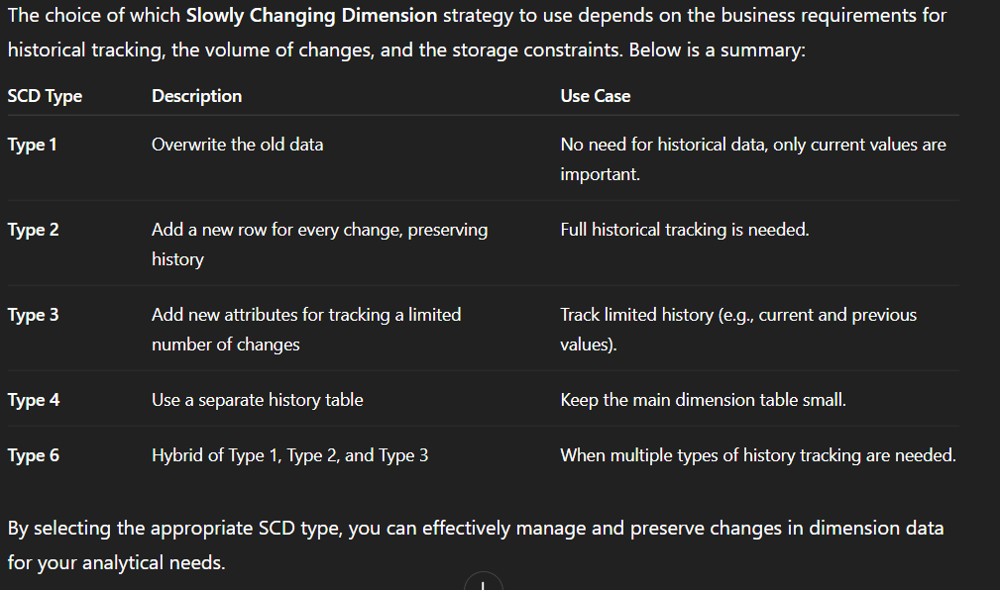

### **DATAWAREHOUSE**
A Data Warehouse is a system that combine data from multiple sources, organizes it under a single architecture, and helps organizations make better decisions. It simplifies data handling, storage, and reporting, making analysis more efficient. Data Warehouse Architecture uses a structured framework to manage and store data effectively.

### **Data Store Vendors**
Data storage solutions are essential for Data Warehousing and Big Data processing. A data store is essentially a repository that stores, organizes, and manages data. There are different types of data stores based on the needs of the organization, such as relational databases, NoSQL databases, and cloud storage.

1. Relational Database Vendors
    -- Oracle
    -- Microsoft SQL Server
    -- MySQL
2. Cloud Data Warehouse Vendors
    -- Google BigQuery
    -- Amazon Redshift
    -- Snowflake
3. NoSQL Database Vendors (for Big Data)
    -- MongoDB
    -- Cassandra
    -- Couchbase

When choosing a data store vendor for your data warehouse or big data needs, it’s essential to evaluate the specific requirements of your organization. Factors like data volume, real-time analytics needs, cloud vs. on-premise solutions, and budget will influence the best choice.

### **✅ OLTP (Online Transaction Processing)**
🔍 Definition:
OLTP systems manage and record real-time transactions in day-to-day operations. They focus on speed, accuracy, and concurrency in handling numerous short online transactions.
**📈 OLAP (Online Analytical Processing)**
🔍 Definition:
OLAP systems are designed for data analysis and complex queries on historical data. They support decision-making by providing multidimensional views of business data.

## 🏢 **Operational Data Store (ODS)**

### ✅ **What is it?**

An **ODS** is a centralized database that integrates data from multiple **operational systems** in near real-time. It's used for **current, up-to-date reporting and decision-making**.

### 🧩 **Key Features:**

* Stores **current (short-term)** operational data.
* Updated frequently (daily/hourly/minutely).
* **Low latency** – supports **real-time or near-real-time** queries.
* Often used as a **pre-processing layer** before loading into the Data Warehouse.

### 📚 **Use Case Example:**

* A bank uses an ODS to view all customer transactions across systems (credit, loans, savings) as of the current day before sending summary data to the DWH for long-term storage.

## 📊 **Data Mart**

### ✅ **What is it?**

A **Data Mart** is a **subset** of a **Data Warehouse (DWH)** designed to focus on a **specific business area** or department, such as sales, marketing, finance, etc. It contains relevant data optimized for the needs of that department or user group.

### 🧩 **Key Features:**

* **Subset of DWH**: A data mart contains only a portion of the data from the DWH.
* **Department-specific**: Tailored for a specific department's needs (e.g., sales, HR).
* **Faster query performance**: Smaller datasets lead to quicker queries.
* **Simplified Access**: Users in the department can access it without complex queries across the entire DWH.
* **Can be dependent or independent**:

  * **Dependent Data Mart**: Created from an existing DWH.
  * **Independent Data Mart**: Created without a DWH, directly from operational systems.

### 📚 **Use Case Example:**

* A **Sales Data Mart** may include data such as customer transactions, product sales, and sales performance metrics, all tailored to the needs of the sales department.

## 🧹 **Data Cleansing**

### ✅ **What is it?**

**Data Cleansing** (also known as **Data Cleaning**) is the process of identifying and correcting (or removing) errors, inconsistencies, and inaccuracies in the data to improve its quality.

### 🧩 **Key Features:**

* **Error Detection**: Identifying missing, duplicate, or inaccurate data.
* **Standardization**: Making data consistent (e.g., formatting dates, addressing different units of measurement).
* **Normalization**: Adjusting data to fit within a consistent scale or range (e.g., converting all addresses to a standard format).
* **Validation**: Ensuring data meets required formats or business rules (e.g., a valid email format).
* **De-duplication**: Removing duplicate records that skew analysis.

### 📚 **Use Case Example:**

* In a customer database, **Data Cleansing** might involve correcting misspelled names, filling in missing contact information, and standardizing phone numbers to a single format.

## 🧠 **1. Conceptual Data Model**

### ✅ **What is it?**

The **Conceptual Data Model** is a **high-level, abstract representation** of the data requirements for a system, without considering how the data will be physically stored. It focuses on identifying the entities and their relationships within the business context. It is designed to answer **what data is needed**, without any implementation details.

## 📐 **2. Logical Data Model**

### ✅ **What is it?**

The **Logical Data Model** is a **detailed representation** of the data, focusing on the structure of the data elements and their relationships. It takes into account the **business rules** and **data integrity constraints**, but it is still **independent of any database management system (DBMS)**. This model focuses on **how data will be organized** in terms of tables, keys, and relationships.

## 🏗️ **3. Physical Data Model**

### ✅ **What is it?**

The **Physical Data Model** is the **implementation** of the logical model, considering the **performance** and **storage requirements** of the database system. It describes **how the data will be stored** in the database, including indexing, partitioning, and other performance optimizations.

### ✅ **Summary:**

* **Conceptual Model**: High-level, abstract representation focusing on the business requirements and entities.
* **Logical Model**: Detailed structure of data (tables, columns, relationships) but still DBMS-agnostic.
* **Physical Model**: DBMS-specific design focused on how the data will be stored, accessed, and optimized for performance.

**Normalization:**
1NF: Ensure no repeating groups (e.g., separate courses for each enrollment).

2NF: Ensure no partial dependencies (e.g., each non-key attribute depends on the entire primary key).

3NF: Eliminate transitive dependencies (e.g., removing attributes dependent on other non-key attributes).

**Dimensional Modeling**

**Dimensional Modeling** is a design technique used in data warehousing to structure data in a way that is optimized for querying and reporting. It is especially useful in **Online Analytical Processing (OLAP)** systems, where the goal is to enable fast, efficient querying of large datasets for business intelligence (BI) and analytical purposes.

 **1. Fact Table**

The **Fact Table** is the central table in a dimensional model. It contains **measurable, quantitative data** that represents business metrics or facts. Fact tables are generally **numeric** and contain the values that users want to analyze or aggregate.

**2. Dimension Table**

A **Dimension Table** contains descriptive, textual, or categorical information related to the dimensions of the facts. Dimensions provide the context for analyzing the facts.

**3. Star Schema**

The **Star Schema** is one of the simplest and most commonly used designs in dimensional modeling. In the star schema, there is a **central fact table** surrounded by **dimension tables**. The fact table contains foreign keys that reference the dimension tables.

#### Characteristics of Star Schema:

* **Fact Table** at the center.
* **Dimension Tables** surrounding the fact table, each containing attributes related to the fact.
* **Simplified** structure for easy querying and high performance.

 **4. Snowflake Schema**

The **Snowflake Schema** is a variation of the **Star Schema** where the dimension tables are **normalized** into multiple related tables. This results in a more complex structure with additional relationships but can reduce redundancy.

 **6. Slowly Changing Dimensions (SCD)**

**Slowly Changing Dimensions** (SCD) are dimensions where the data does not change frequently but still needs to be tracked over time. There are several types of SCDs, depending on how the changes are handled.

#### Types of Slowly Changing Dimensions:

* **SCD Type 1**: **Overwrite**—Old data is replaced by new data (no history is maintained).
* **SCD Type 2**: **Add new row**—New data is added, and a history of changes is maintained (e.g., adding a `Start_Date` and `End_Date` to capture history).
* **SCD Type 3**: **Add new attribute**—Old data is preserved in a new attribute, maintaining limited history.

### **When to Use Each Schema?**

* **Star Schema** is ideal for:

  * Smaller datasets or scenarios where **query performance** is a priority.
  * Business users or analysts who require a **simple and easy-to-understand** model.
  * Scenarios where **quick and easy reporting** is needed.

* **Snowflake Schema** is ideal for:

  * Larger, more complex datasets where **data redundancy** is a concern.
  * Situations where **data integrity** and **storage optimization** are crucial.
  * Complex analytical systems where **normalization** offers flexibility and long-term maintenance benefits.

---

### **Summary:**

* The **Star Schema** offers simplicity and fast query performance but sacrifices storage efficiency due to denormalized tables.
* The **Snowflake Schema** offers better storage efficiency and reduces redundancy but introduces complexity and can slow down performance due to multiple table joins.

### **Data Warehouse (DWH) Vendors**

There are several vendors that provide **Data Warehouse (DWH)** solutions, each offering unique features, performance capabilities, and deployment options. These vendors are critical for organizations that need robust, scalable, and high-performance data warehouses for business intelligence (BI), reporting, and analytics.

### **Introduction to Google BigQuery**

**Google BigQuery** is a fully managed, serverless, highly scalable, and cost-effective data warehouse that allows users to analyze vast amounts of data using SQL-like queries. It is a part of the **Google Cloud Platform (GCP)** and is designed to handle large-scale data analytics and processing tasks with high performance and low latency.

BigQuery enables users to perform fast, SQL-based analytics on datasets that may span terabytes, petabytes, or even exabytes of data, all while eliminating the need to manage the underlying infrastructure. BigQuery's serverless architecture ensures that users don't have to worry about provisioning, scaling, or managing the infrastructure needed to run big data workloads.

### **BigQuery Architecture**

The architecture of BigQuery is built on top of Google's distributed computing infrastructure. The key components are:

1. **Storage Layer**:

   * Data in BigQuery is stored in **tables** and organized into **datasets**. The data is stored in a columnar format, optimized for fast analytics. Google Cloud Storage and Colossus, Google’s file system, are responsible for storing the underlying data.

2. **Query Layer**:

   * Queries are processed using a massively parallel processing (MPP) architecture. BigQuery automatically distributes query execution across multiple nodes and processes the data in parallel to achieve high performance.

3. **Query Execution Engine**:

   * BigQuery uses the Dremel query engine, which is highly efficient for executing queries across massive datasets. The engine breaks down queries into small tasks and processes them in parallel, minimizing execution time.

4. **Storage and Compute Separation**:

   * BigQuery’s architecture is based on separating storage and compute resources. This allows users to scale storage independently from compute resources, making it more cost-effective.

5. **Data Loading and Streaming**:

   * Data can be ingested into BigQuery through batch loading, real-time streaming, or by directly linking external data sources. BigQuery supports streaming data through the **BigQuery Streaming API**, which enables users to ingest real-time data into BigQuery for analysis.

### **Using the BigQuery Sandbox**

The **BigQuery Sandbox** is a free, limited environment provided by Google Cloud, which allows users to explore and test **Google BigQuery** without needing a billing account. It provides access to BigQuery's powerful data analytics features with some limitations on usage. The Sandbox is ideal for users who want to try out BigQuery, run small queries, and experiment with data processing without incurring any costs.

### **BigQuery Dry Runs**

A **BigQuery Dry Run** is a feature in Google BigQuery that allows users to simulate the execution of a query without actually running it and incurring any charges. It is a helpful tool to estimate the amount of data a query will process and the potential costs associated with it. Dry runs are ideal for testing queries and optimizing them before running them on large datasets.

---

### **What is a Dry Run in BigQuery?**

A **dry run** is essentially a simulation of a query's execution. It allows BigQuery to analyze the query, check for errors, and calculate the amount of data it would process if the query were to run, without actually executing it. This helps users understand the impact of their query in terms of cost and performance.

### **What Information is Returned in a Dry Run?**

After performing a dry run, BigQuery provides you with information about:

1. **Estimated Data Processed**:

   * BigQuery will estimate how much data the query would process (measured in bytes). This is the key piece of information that helps you assess the cost of running the query.

2. **Query Validation**:

   * The dry run will also validate the query for errors, checking for syntax issues, missing tables, or invalid column references.

3. **Warnings or Errors**:

   * If there are issues with the query, BigQuery will provide detailed error messages to help you fix the problems.

---

### **for commands visit main file**